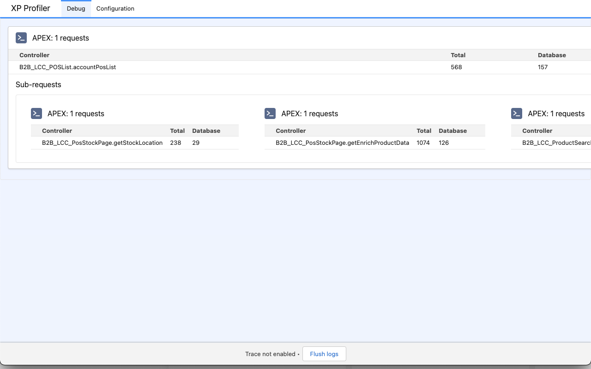

# sf-xp-debugger

This cross-browser extension provides capability to debug traces directly in the browser developer tools for Experience Cloud Websites.

The extension is developed as cross-browser, but has been only tested on Chrome.

It makes use of https://github.com/financialforcedev/debug-log-analyzer to display log information.

## Installation
 * Download repository
 * `npm install`
 * `npm run build`
 * Load extension as unpacked from the `build` folder
## Icon

Agent icons created by Freepik - Flaticon: https://www.flaticon.com/free-icons/agent